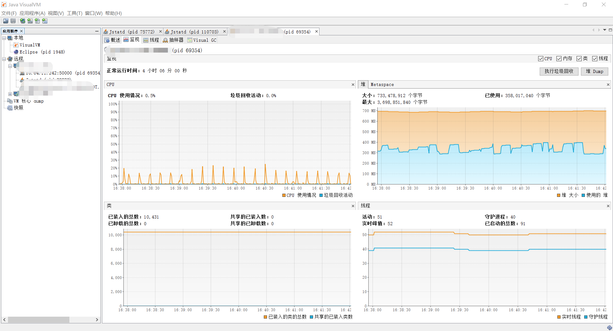
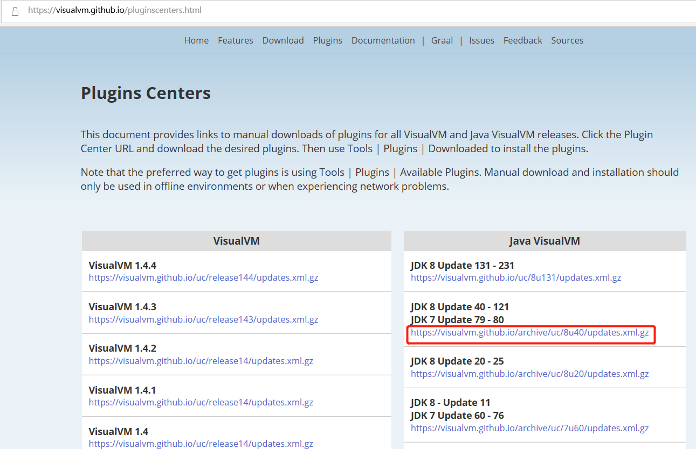
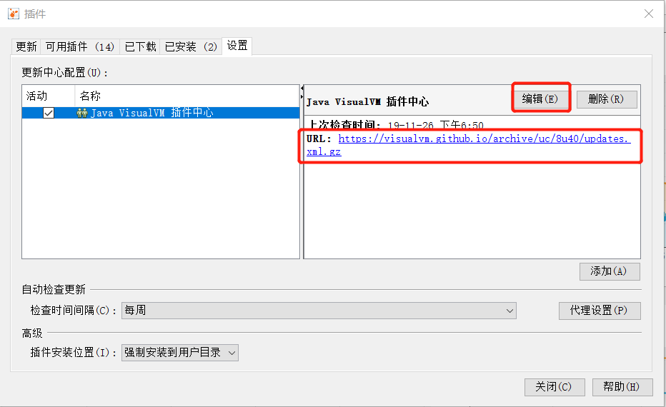
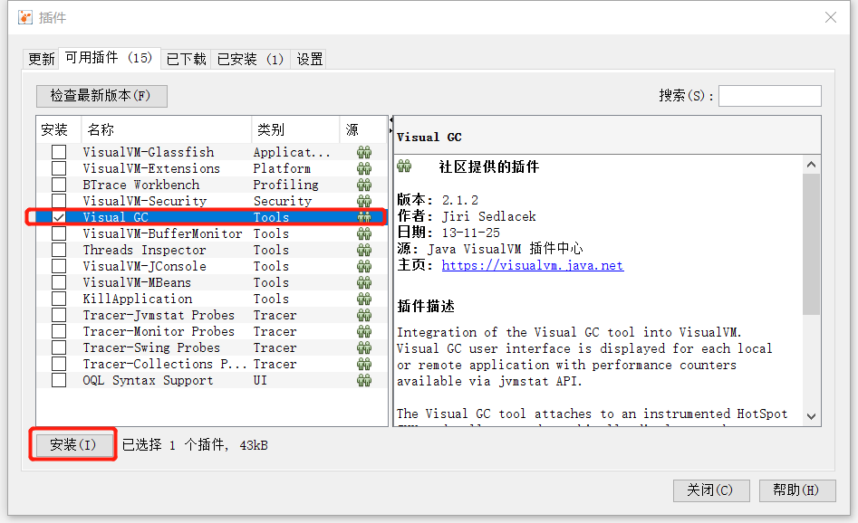
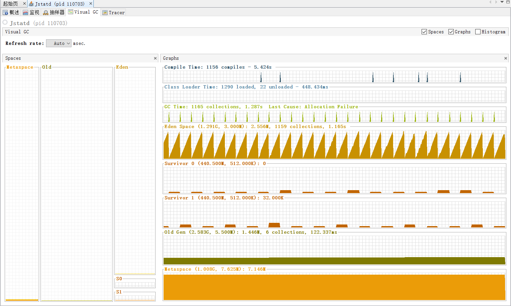

# JVM虚拟机监控及性能调优

## 目录

* [jvisualvm介绍](jvm-xu-ni-ji-jian-kong-ji-xing-neng-tiao-you.md#jvisualvm介绍)
* [jvisualvm使用](jvm-xu-ni-ji-jian-kong-ji-xing-neng-tiao-you.md#jvisualvm使用)
  * [jvisualvm监控远程服务器](jvm-xu-ni-ji-jian-kong-ji-xing-neng-tiao-you.md#jvisualvm监控远程服务器)
  * [jvisualvm集成Visual GC插件](jvm-xu-ni-ji-jian-kong-ji-xing-neng-tiao-you.md#jvisualvm集成Visual-GC插件)
* [常见问题](jvm-xu-ni-ji-jian-kong-ji-xing-neng-tiao-you.md#常见问题)
* [引用](jvm-xu-ni-ji-jian-kong-ji-xing-neng-tiao-you.md#引用)

### jvisualvm介绍

1. jvisualvm是JDK自带的可以远程监控内存，跟踪垃圾回收，执行时内存，CPU/线程分析，生成堆快照等的工具。
2. jvisualvm是从JDK1.6开始被继承到JDK中的。

### jvisualvm使用

#### jvisualvm监控远程服务器

`开启远程监控`

* 通过在服务器上设置jmx参数来开启

  ```text
    vi /etc/profile
    export JAVA_OPTS='-Dcom.sun.management.jmxremote=true -Dcom.sun.management.jmxremote.port=N -Djava.rmi.server.hostname=x.x.x.x -Dcom.sun.management.jmxremote.ssl=false -Dcom.sun.management.jmxremote.authenticate=false'
  ```

* 通过启动jar命令开启

  ```text
    java -Dcom.sun.management.jmxremote=true -Dcom.sun.management.jmxremote.port=N -Djava.rmi.server.hostname=x.x.x.x -Dcom.sun.management.jmxremote.ssl=false -Dcom.sun.management.jmxremote.authenticate=false -jar xxx.jar
  ```

`连接`

* 打开jvisualvm，在远程中添加需要监控的服务器，然后再在该服务器下添加jmx监控连接

  

#### jvisualvm集成Visual-GC插件

`Visual GC插件安装`

* 到[https://visualvm.github.io/pluginscenters.html去下载对应的Visual](https://visualvm.github.io/pluginscenters.html去下载对应的Visual) GC Plugins

  

* 更改visual-gc配置中心URL

  

* 安装Visual GC Plugin

  

`Visual GC正确开启步骤`

* 在远程主机上添加安全策略文件

  ```text
    [root@localhost ~] touch jstatd.all.policy
    [root@localhost ~] vi jstatd.all.policy
    grant codebase "file:${java.home}/../lib/tools.jar" {
        permission java.security.AllPermission;
    };
  ```

  > 注意：如果没有配置JDK环境变量，file后需要添加tool.jar的绝对路径

* 在远程主机上启动监控

  ```text
    [root@localhost ~] jstatd -J-Djava.security.policy=/xxx/jstatd.all.policy  -J-Djava.rmi.server.logCalls=true -J-Djava.rmi.server.hostname=xx.xx.xx.xx -p 1099
  ```

  * 参数说明
    * -J-Djava.rmi.server.logCalls=true 打开日志，便于排错
    * -J-Djava.rmi.server.hostname=xx.xx.xx.xx hostname是本机IP地址，确保client能访问到，另外查看本机的hosts是否有其他配置，这里有坑，具体参照常见问题中的[XXXX](jvm-xu-ni-ji-jian-kong-ji-xing-neng-tiao-you.md)

* 可以查看端口是否被正常监听

  ```text
    [root@localhost ~]# lsof -i:1099
    COMMAND    PID USER   FD   TYPE  DEVICE SIZE/OFF NODE NAME
    jstatd  110703 root   15u  IPv6 7374636      0t0  TCP *:rmiregistry (LISTEN)
    jstatd  110703 root   17u  IPv6 7373817      0t0  TCP localhost:rmiregistry->x.x.x.x:62209 (ESTABLISHED)
  ```

* 使用visualvm连接
  * 添加jstatd连接，注意端口号和远程服务器开启的端口号保持一致

    > 注意：远程服务器端口要设置开放
* 参考视图 

## 常见问题

* 开启OOM-dump

  ```text
    nohup java -Dcom.sun.management.jmxremote=true -Dcom.sun.management.jmxremote.port=N -Djava.rmi.server.hostname=x.x.x.x -Dcom.sun.management.jmxremote.ssl=false -Dcom.sun.management.jmxremote.authenticate=false -XX:+HeapDumpOnOutOfMemoryError -jar xxx.jar -XX:HeapDumpPath=~/dumps/ > nohup.log 2>&1 &
  ```

* Visual GC提示"不受此JVM支持“

  ```text
    Could not create remote object
    access denied ("java.util.PropertyPermission" "java.rmi.server.ignoreSubClasses" "write")
    java.security.AccessControlException: access denied ("java.util.PropertyPermission" "java.rmi.server.ignoreSubClasses" "write")
        at java.security.AccessControlContext.checkPermission(AccessControlContext.java:472)
        at java.security.AccessController.checkPermission(AccessController.java:884)
        at java.lang.SecurityManager.checkPermission(SecurityManager.java:549)
        at java.lang.System.setProperty(System.java:792)
        at sun.tools.jstatd.Jstatd.main(Jstatd.java:139)
  ```

* Could not contact registry，指向的IP地址是一个其他的地址

  ```text
    [root@localdomain bin]# ./jstatd -J-Djava.security.policy=jstatd.all.policy
    Could not contact registry
    Connection refused to host: y.y.y.y; nested exception is:
            java.net.ConnectException: Connection refused
    java.rmi.ConnectException: Connection refused to host: y.y.y.y; nested exception is:
  ```

  > 注意：我在这里查看了远程机器的hosts，发现其配有一些其他的IP，将其删除后能够联通 \*
  >
  > ## 引用

* [jvisualvm简要说明](https://blog.csdn.net/weixin_38750084/article/details/83314046)
* [jvisualvm 连接 jstatd 远程监控 jvm 或 Visual GC提示"不受此JVM支持“](https://blog.csdn.net/liupeifeng3514/article/details/78998161)
* [使用Java VisualVM监控远程JVM](https://www.jianshu.com/p/2a6658e94ae2)
* [Visualvm 远程测试 问题](https://www.cnblogs.com/kentyshang/archive/2009/08/20/1550745.html)
* [visualgc - Visual Garbage Collection Monitoring Tool](https://www.oracle.com/technetwork/java/visualgc-136680.html)

